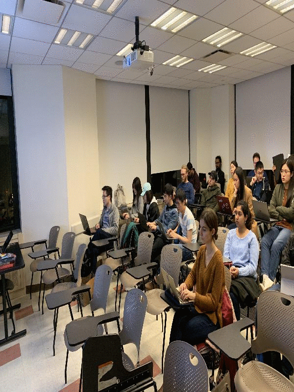

# \[TUTORIAL\] Pytorch FasterRCNN (CustomDataset)
Pytorch based FasterRCNN for custom dataset with explanation

[PAPER](https://arxiv.org/pdf/1506.01497.pdf)
``` 
Faster R-CNN: Towards Real-Time Object Detection with Region Proposal Networks
Shaoqing Ren, Kaiming He, Ross Girshick, Jian Sun
```

Tutorial / Credits / Source :  [source](https://towardsdatascience.com/faster-r-cnn-object-detection-implemented-by-keras-for-custom-data-from-googles-open-images-125f62b9141a)  ||  [Github](https://github.com/RockyXu66/Faster_RCNN_for_Open_Images_Dataset_Keras)

In case of any confusion, please raise a query. 

## Github GUIDE

* Update `config class` in `main.py` (assign indices to your custom classes)
* `tools.py` has all the bounding boxes/anchor box related things
* `dataset.py` is manipulation bounding box with respect to various transformations
* `debug.py` has debugging codes (some of them migh not work, while I was testing various functions)
* `plot.py` has the code to visualize anchor boxes and bounding boxes
* `loss.py` has loss functions 
* `utiils.py` are basic functions IOU calculatins, saving models loading models etc.
* `model.py` is the collections of 2 simple models (most important manipulation of Faster RCNN comes from `tools.py`). 

Run someting like 
```
python main.py --pretrained  --data-format='bg_first' --save-evaluations --
```

## Custom Dataset

* Create 2 json files for each set (train, validation, test)  (I have only test and train set so 4 json files)    
Converting dict to json [GUIDE](https://github.com/ppriyank/Object-Detection-Custom-Dataset-pytorch/blob/master/annotation.py)
* Naming convention : `TRAIN_images.json`, `TRAIN_objects.json`, `TEST_images.json`, `TEST_objects.json`    
* `TRAIN_images.json` contains path to various images, e.g. : ["../class_pics/IMG_0.jpg", "../class_pics/IMG_1.jpg" ... ]  
* `TRAIN_objects.json` contains list of dictionaries, i-th dictionary corresponding to i-th image in the  `TRAIN_images.json`.   
Each dictinoary contains keys :   
**boxes** : list of all bounding boxes: [xmin, ymin, xmax, ymax])   
**labels**  : list of labels corresponding to each bounding box

#### Note 
* Please note background class is the last index, that means you indexing of classes should with 0  
* Sample `TEST_images.json`, `TEST_objects.json` have been uploaded  
* I have removed difficulty tag, don't need 
* just changes the desired labels in config class in main.py according to your new label set.

In case of error, raise an issue :) 


### Performance :  
Sample training image, after training the model for 10 epcohs for a dataset of 17 images with imbalanced bounding boxes





## Explanation 

### Entire Pipeline


### Example of how aspect ratio works (Equation : 1):  


### Dimension Convention :  


### All possible anchor boxes


### anchor box

For each point on output layer of Resnet / base model (known as anchor point : 2048 , 20, 10 ==> (20 x 10) anchor points)  is the center for an anchor box on the original image. Each point has 3 bounind boxes (by default) and each of these bounding boxes comes in to different aspect ratio (3 by default) (keeping the area same, see first diagram on how aspect ratio works). Hence 9 anchor boxes are possible corresponding to each anchor points. Each of these anchor boxes (9 * 20 * 10 ) are compared with golden bounding boxes or ground truth boxes, result is either positive : (overlap with golden bounding box > 0.7) or negative (overlap with ground truth box < 0.3) or neutral (0.3 < iou < 0.7). 

Each of these anchor boxes are given label:   
* +1 for positive anchor box, 
* -1 for negative anchor box, 
* 0 for neutral (ambigious) anchor box  


For each ground truth bounding box, highest iou anchor box is kept , along with **tx, ty, th, tw** (see figure below)


`num_anchors_for_bbox` stores the number of positive anchor boxes associated with that golden bounding boxes.


How anchor boxes look like : 


### RPN to ROI

 
`default_anchors` is the set of (xmin, ymin, width , height ) of all possible anchor boxes on the downscaled output feature space of base model (e.g. for 800x600 image => downscaled output feature space is 50 x 38 ).  *all_possible_anchor_boxes[:,**i**,j, k]* and *all_possible_anchor_boxes[:,**m**,j, k]* will have the same xmin, width and height but different y_min. Similarly *all_possible_anchor_boxes[:,i,**j**, k]* and *all_possible_anchor_boxes[:,i,**m**, k]* will have same ymin, height and width. 


Model predicts : reg_k : (tx, ty, tw, th) : given all the possible anchor boxes, one can estimate the model's predicted anchor boxes (model can't predict coordinates of anchor boxes apprently).

### CALC IOU (calc_iou function)

For every model rpn predictions (tx, ty, tw, th) converted to most probable bounding (anchor) boxes, closest GT anchor box is associated. For the anchor box to be **qualified anchor box**, only if iou is greater than 0.1. If Iou is > 0.5 (positive anchor box ), If 0.1 < iou < 0.5 negative bounding box and less than <0.1 is ambigious (ignored). For positive boxes [tx, ty, tw, th] is calculated (used for training the mdoel). It returns 
* X : Positive/Negative anchor boxes (n , 4)  
* Y1 : Label of the ground truth of anchor box associated withe qualified bounding boxes (n , # of classes)
* Y2  : concatenation of the labels : 1 if positive else 0 (n,4 * (# of class - 1) ) labels per class and 4 times because of the 4 values (tx, ty, tw, th) associated with the anchor boxes : (n,4 * (# of class - 1)).

where n is the qualified number of anchor boxes. 

## None Max Supression (Fast)


### Model

##### Model_RPN

It returns 3 tensors : base_x , cls_k , reg_k.   

**base_x** is the output of base layer (resnet in my case), the vector representation of the image.     
  

**cls_k** is the model's prediction corresponding to each anchor box (9 in my case), where the prediction being the probability of anchor being positive anchor (trained via cross entorpy loss). Positive GT anchor box : +1, Negative anchor box= 0. Neutral boxes are ignored.   
  

**reg_k** is the regression values corresponding to positive GT anchor boxes. (trained via smooth L1 loss)  


##### Classifier

For every qualified anchor boxes from model_rpn (in calc_iou function),   
* Model is tasked to predict the class inside that qualified anchor box. 
* Model is tasked to predict the (tx, ty, tw, th), the values of deviation of the anchor box from the actual GT anchor box. 


### Future Work :
- [ ] requirement.txt 
- [ ] Save temp file for data loading   
- [ ] parallelize the code (calc_rpn function) ??  
- [ ] Remove log from tw and th to check if performance changes??
